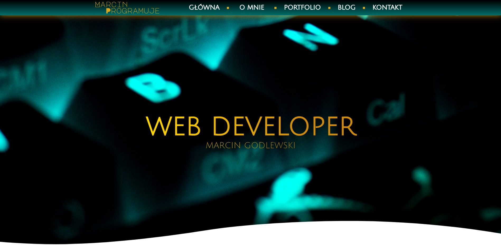
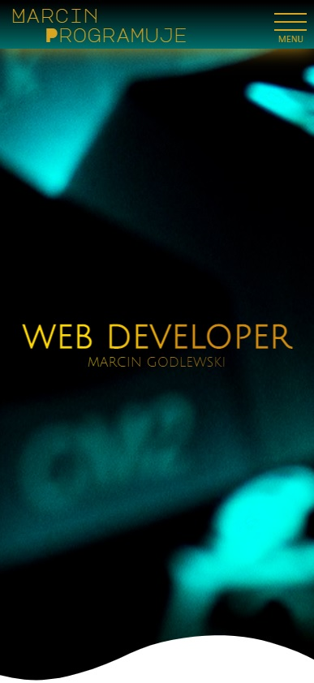
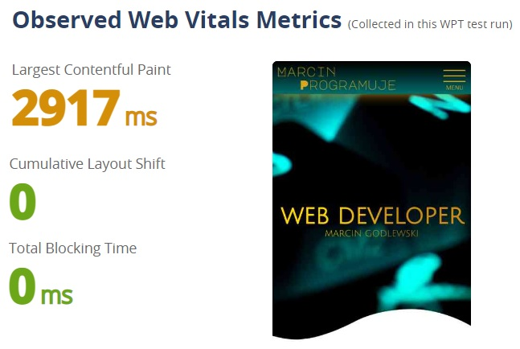

## Table of contents
* [General info](#general-info)
* [Technologies](#technologies)
* [Screens](#screens)
* [Core Web Vitals Test](#core-web-vitals-test)
* [Live](#live-star2)

## General info
My brandnew portfolio site. It contains a complete set of information about my person, my experience, skills as well as projects located in the tab - portfolio.

## Technologies
Project was created with:
* HTML5
* SCSS
* JavaScript

## Screens
* Desktop version :computer:     

 

* Mobile version :iphone:     

 

## Core Web Vitals Test   

 

## Live :star2:
https://goldipl.github.io/Marcin-Programuje/